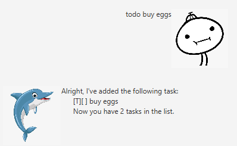
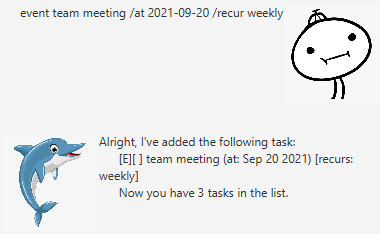
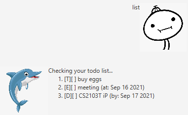
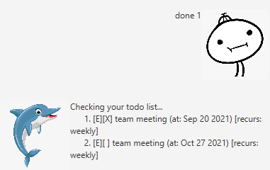
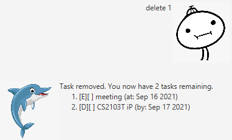
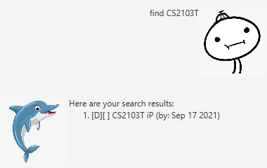

# User Guide

## Quick Start 
1. Ensure you have Java `11` or above installed in your Computer.
2. Download the latest `duke.jar` from [here](https://github.com/kaldius/ip/releases/tag/A-Release).
3. Copy the file to the folder you want to use as the *home folder* for your Duke.
4. Start the app and begin typing commands! Try this out:
    * todo learn to use Duke!
    * list
    * done 1
    * delete 1
5. Refer to the **Usage** below for the details of each command
## Usage

### `todo` - Add a todo

Adds a todo item to the to-do list.

Format: `todo TASK`

Example of usage:

`todo buy eggs`

Expected outcome:

Duke will give you a confirmation that the todo has been added.

### `event` - Add an event

Adds an event item to the to-do list.

Format: `event TASK /at YYYY-MM-DD /recur RECURRENCE` NOTE: `RECURRENCE` is an **optional** field (default recurrence: never) which can only be one of the following:
* daily
* weekly
* monthly

Example of usage:

`event meeting /at 2021-09-16`

Expected outcome:

Duke will give you a confirmation that the event has been added.

Example of usage (recurring event):

`event team meeting /at 2021-09-20 /recur weekly`

Expected outcome:

Duke will give you a confirmation that the recurring event has been added.

### `deadline` - Add a deadline

Adds a deadline item to the to-do list.

Format: `deadline TASK /by YYYY-MM-DD`

Example of usage:

`deadline CS2103T iP /by 2021-09-17`

Expected outcome:

Duke will give you a confirmation that the deadline has been added.

### `list` - List all tasks

Lists all tasks in the to-do list.

Format: `list`

Expected outcome:

Duke will show all the tasks in the to-do list.

### `done` - Mark as done

Marks a task as done.

Format: `done INDEX`

* Marks the task at specific `INDEX` as complete
* The index refers to the index number shown in the displayed task list
* The index **must be a positive integer** 1, 2, 3...

Expected outcome:

Duke will show all the tasks in the to-do list, with the completed ones marked with a [X].

Expected outcome (for recurring task):

Duke will show all the tasks in the to-do list, with the completed ones marked with a [X]. A new recurring task will also be created.

### `delete` - Remove a task

Removes a task from the to-do list.

Format: `delete INDEX`

* Deletes the task at specified `INDEX`
* The index refers to the index number shown in the displayed task list
* The index **must be a positive integer** 1, 2, 3...

Expected outcome:

Duke will show all the tasks in the to-do list, without the deleted ones. All tasks below the deleted task will be shifted up the list.

### `bye` - Save the current to-do list

Saves the current to-do list to the hard drive. This will be opened again the next time Duke is started up.

Format: `bye`

Expected outcome:

Duke will save all tasks to the hard drive and say goodbye.

### `find` - Searches the to-do list

Searches the to-do list for a task that has the specified search term in its description.

Format: `find SEARCHTERM`

Expected outcome:

Duke will list out all the tasks that have descriptions matching the `SEARCHTERM`.

## Command Summary
Action|Format|Examples
------|------|--------

todo|`todo TASK`| `todo buy eggs`
event|`event TASK /at YYYY-MM-DD /recur RECURRENCE`|`event meeting /at 2021-09-16`, `event team meeting /at 2021-09-20 /recur weekly`
deadline|`deadline TASK /by YYYY-MM-DD`|`deadline CS2103T iP /by 2021-09-17`
list|`list`|-
done|`done INDEX`|`done 2`
delete|`delete INDEX`|`delete 3`
bye|`bye`|-
find|`find SEARCHTERM`|`find CS2103T`